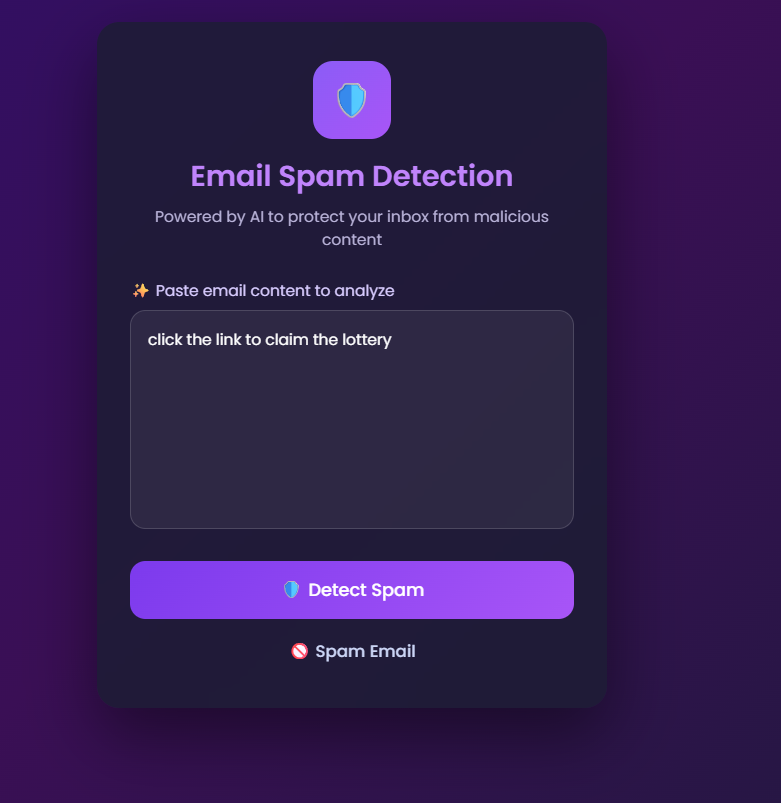
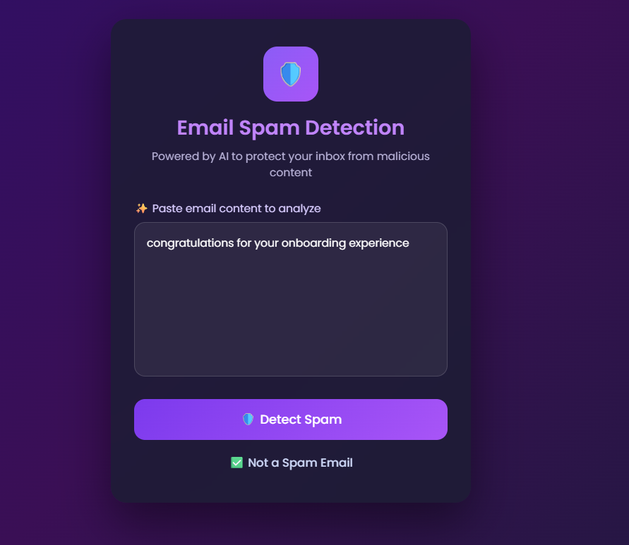

📧 AI Email Spam Detection System

A modern AI-powered email spam detection web application that classifies emails as Spam or Not Spam using a machine learning backend and a stylish JavaScript-based frontend.

This project demonstrates real-world frontend–backend integration, clean UI/UX design, and practical use of AI in web applications.

---

Features:


1.Detects whether an email is Spam or Not Spam

2.Modern, professional Al-style UI with smooth interactions using javascript

3.Real-time prediction using Flask API

4.Al logic abstracted in backend (clean separation of concerns)

5.Responsive and user-friendly design

6.Proper error handling and validation

---

Tech Stack:


Frontend:


HTML5

CSS3 (Glassmorphism, gradients, animations)

JavaScript (Vanilla JS)


Backend:


Python

Flask

Flask-CORS

---

Project structure:
```text

AI-Email-Spam-Detection
│
├── frontend
│   ├── index.html
│   ├── style.css
│   ├── script.js
│   ├── spamService.js
│   └── uiHelpers.js
│
├── backend
│   └── app.py
│
└── README.md

```

---
How It Works:


1. User enters email content in the UI

2. JavaScript validates input and sends data to backend using fetch()

3. Flask API receives the email text

4. Backend analyzes the content using spam keywords logic

5. API returns prediction ( Spam / Not Spam)

6. Frontend dynamically updates the UI with color-coded result
---

How to run locally:

```text
1.Start backend server:
    cd backend
    python app.py
Server will run at:
    http://127.0.0.1:5000
```

```text
2. Run frontend:
Open frontend/index.html in your browser
        or 
Use Live Server extension in VS Code
```
---

🧪 Sample Test Inputs:


Spam Example:

Click the link to claim benefits now

Not Spam example:

Be ready for a technical interview scheduled tomorrow

---
## 📧 Project Demo

<p align="center">
  <b>Demo</b>
</p>

<p align="center">
  
</p>

<br>

<p align="center">
  <b>Demo</b>
</p>

<p align="center">
  
</p>

---

🎯 Learning Outcomes:


Hands-on experience with JavaScript async/await

API integration using Fetch API

Frontend & backend separation

Real-world AI application flow

UI/UX design for AI-based systems

Git & project structuring best practices

---
    
📌 Use Case:


Email security systems

AI-powered content filtering

Frontend–backend integration demos

Resume & interview showcase project

---

🧠 Future Enhancements:


Replace rule-based logic with trained ML model

Add confidence score for predictions

Deploy backend and frontend online

Support file/email upload

Improve accessibility and animations

---

👩‍💻 Author


GOPU SRAVANI

Aspiring Software Developer

Passionate about JavaScript, AI integration, and building real-world web applications.

---

⭐ If you like this project

Give it a ⭐ on GitHub — it motivates me to build more!
